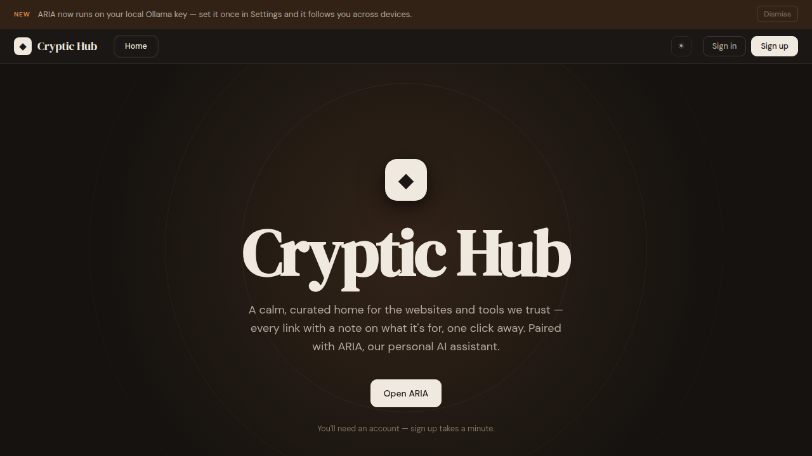
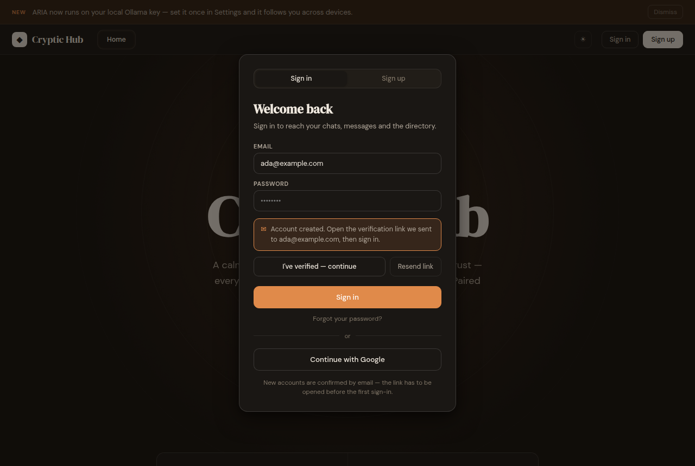

# Cryptic Hub

A calm, curated home for the websites and tools worth keeping — a searchable
directory, **ARIA** (an assistant that runs on your own model key), and messages
between members. The interface is the original design export, wired to
**Firebase Authentication** with mandatory email verification and deployed as a
static site on **Vercel**.



---

## Quick start

```bash
npm install
npm run dev        # http://localhost:5173
```

```bash
npm run build      # static output in dist/
npm run preview    # serve dist/ locally
```

No `.env` file is required — the Firebase config in `src/firebase.js` has
working defaults. See [Configuration](#configuration) to point the app at a
different Firebase project.

---

## Deploying to Vercel

The repo is deploy-ready: `vercel.json` pins the framework, build command and
output directory, so Vercel needs no manual settings.

**From the dashboard**

1. **Add New… → Project**, import this repository.
2. Vercel detects Vite. Leave the defaults (build `npm run build`, output
   `dist`) and click **Deploy**.

**From the CLI**

```bash
npm i -g vercel
vercel          # preview deployment
vercel --prod   # production deployment
```

### One required step in Firebase

Firebase Auth rejects sign-in attempts from domains it doesn't know. After the
first deploy, open **Firebase console → Authentication → Settings → Authorized
domains** and add your Vercel hostnames:

- `your-project.vercel.app`
- any custom domain you attach
- (`localhost` is authorized by default, so local dev already works)

Then, under **Authentication → Sign-in method**, enable:

- **Email/Password** — used by the sign-up and sign-in forms
- **Google** — used by the "Continue with Google" button

Without these two, the dialog will show
*"This sign-in method is turned off in the Firebase console."*

---

## How authentication works

`src/auth.js` owns the session and enforces one rule:

> A password account counts as signed in **only** once its email address is
> verified.

| Step | What happens |
| --- | --- |
| **Sign up** | `createUserWithEmailAndPassword` → display name saved → verification email sent. The dialog switches to the sign-in tab and asks the user to open the link. The account is *not* signed in. |
| **Sign in, not yet verified** | Credentials are accepted, a fresh verification link is sent, and the UI stays signed out with **Resend link** / **I've verified — continue** buttons. |
| **I've verified — continue** | Re-reads the account from Firebase; once `emailVerified` is true the app signs in. |
| **Sign in, verified** | Signed in, session persisted across reloads and tabs (`browserLocalPersistence`). |
| **Continue with Google** | Popup sign-in. Google vouches for the address, so no extra verification step. |
| **Forgot your password?** | Sends a reset link to whatever address is in the email field. |



Unverified accounts stay signed in at the Firebase level — that is the only way
to resend a verification mail or re-check the flag — but they are published to
the UI as signed out, and closing the dialog discards them.

Every Firebase error code is mapped to a plain-English sentence in
`describeError()`; nothing raw ever reaches the user. Passwords must be at least
8 characters, matching the copy in the design.

---

## Project structure

```
index.html                  The page itself: a Design Component (<x-dc> template
                            + inline `data-dc-script` logic) rendered at runtime.
src/
  main.js                   Entry point — publishes the auth API on
                            window.CrypticAuth for the inline logic to call.
  firebase.js               Firebase app, Auth and (production-only) Analytics.
  auth.js                   Sign-up / sign-in / verification / reset, plus
                            human-readable error messages.
public/
  vendor/dc-runtime.js      Runtime that renders the design template.
  vendor/react*.min.js      React 18 UMD builds the runtime needs.
  fonts/*.woff2             Self-hosted DM Sans + DM Serif Display.
  favicon.svg
design/
  cryptic-hub.design-export.html   The original single-file design export this
                                   project was unpacked from. Reference only —
                                   nothing imports it.
vercel.json                 Framework, caching and security headers.
vite.config.js              Build config.
```

Only `src/` goes through the bundler; everything under `public/` is copied
verbatim. Fonts and React are served from your own origin, so the page makes no
third-party requests apart from Firebase itself.

### Editing the interface

The visual layer is the design template inside `index.html`, between `<x-dc>`
and `</x-dc>`, using `sc-if` / `sc-for` / `{{ value }}` bindings. The values
those bindings read come from the `render()` method of the `Component` class in
the `data-dc-script` block further down the same file. Add a value there, then
reference it in the template — that pairing is how every button and field in the
UI is wired.

---

## Configuration

The Firebase web config lives in `src/firebase.js` with sensible defaults, and
each field can be overridden by an environment variable:

| Variable | Overrides |
| --- | --- |
| `VITE_FIREBASE_API_KEY` | `apiKey` |
| `VITE_FIREBASE_AUTH_DOMAIN` | `authDomain` |
| `VITE_FIREBASE_DATABASE_URL` | `databaseURL` |
| `VITE_FIREBASE_PROJECT_ID` | `projectId` |
| `VITE_FIREBASE_STORAGE_BUCKET` | `storageBucket` |
| `VITE_FIREBASE_MESSAGING_SENDER_ID` | `messagingSenderId` |
| `VITE_FIREBASE_APP_ID` | `appId` |
| `VITE_FIREBASE_MEASUREMENT_ID` | `measurementId` |

Copy `.env.example` to `.env.local` for local overrides, or set them under
**Project Settings → Environment Variables** on Vercel (they are read at build
time, so redeploy after changing them).

These values are public client identifiers — Firebase ships them in the browser
bundle by design. Access is controlled by your Auth settings, authorized domains
and security rules, not by keeping them out of the repo. Firebase Analytics is
initialised only on the deployed HTTPS site, and never blocks or breaks the app
if it is unavailable.

---

## Current scope

Authentication, the session and the tour are real and backed by Firebase.
The directory, ARIA conversations and member messages are still the design's
front-end behaviour — they hold state for the session but are not yet persisted
to a backend. The Realtime Database URL is already in the config, so those are
the natural next things to wire up.
